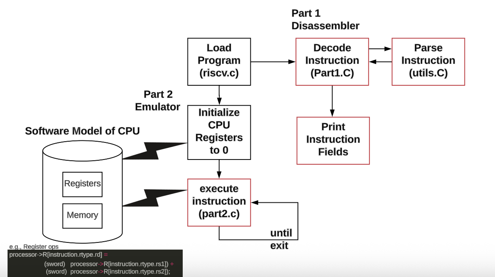
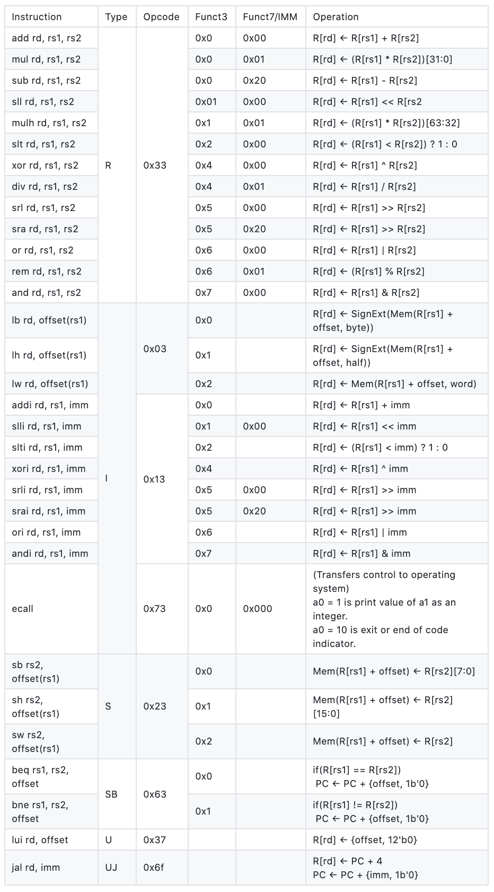

# RISC-V Emulator

This project implements a RISC-V disassembler and emulator in C. It supports decoding machine instructions and executing them with optional tracing and register inspection.

## Project Structure

<br>
## RISCV supported instructions

<br>
```
├── part1.c              # Disassembler implementation
├── part2.c              # Emulator implementation
├── riscv.c              # Main driver and program loader
├── utils.c / utils.h    # Helper functions
├── types.h              # Instruction formats
├── code/
│   ├── input/
│   ├── ref/
│   └── out/
├── scripts/
├── install-cunit.sh
├── Makefile
```
## Installation & Build

Install dependencies:
```
    bash ./install-cunit.sh
```
Compile:
```
    make riscv
```
Run:
```
    ./riscv
```
## Running
```
Disassemble:
    ./riscv -d ./code/input/R/R.input

Run with trace:
    ./riscv -t -r ./code/input/R/R.input

Run full execution:
    ./riscv -t -r -e ./code/input/simple.input
```
## Testing
```
Unit tests:
    touch test_utils.c
    make test-utils

Full tests:
    bash ./scripts/localci.sh
```
## Command Options
```
-d  Disassemble
-t  Trace execution
-r  Print registers
-i  Interactive mode
-e  Execute to end
-v  Initialize registers
```

## Author
Ben Salehirad
